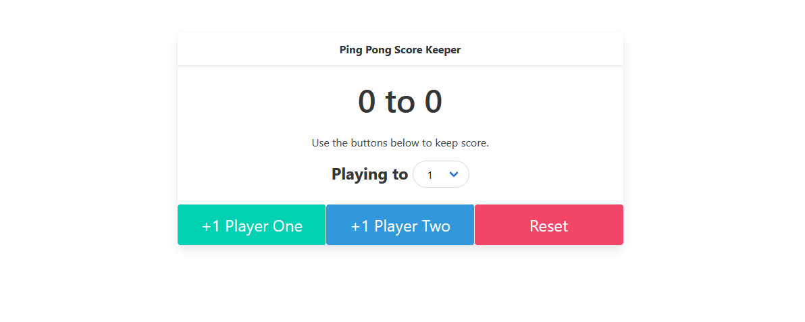

# Ping-Pong-Score-Keeper-With-Vanilla-JS

- Working site : https://score-keeper-by-omer.netlify.app/

## Table of contents

- [Table of contents](#table-of-contents)
- [General info](#general-info)
- [Technologies](#technologies)
- [Features](#features)
- [Screenshots](#screenshots)

## General info

- This project is built to improve Javascript skills.

## Technologies

- HTML
- CSS-framework: Bulma
- Javascript

# Clone this repository

\$ git clone https://github.com/DegirmenciOmer/Ping-Pong-Score-Keeper.git

## Features

- Keep scores of two players.
- Set the winning score.
- When either of the players reach the winning score, the game ends.
- Click the reset button to start a new game

## Screenshots

 
